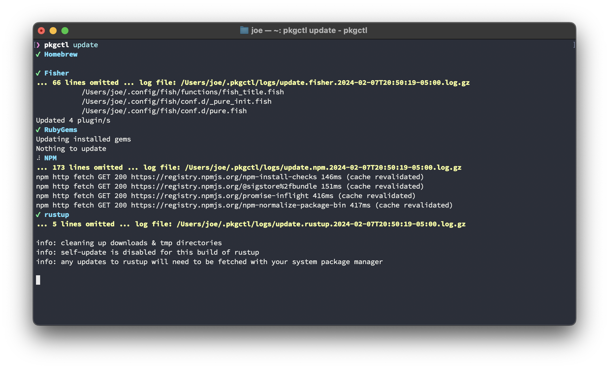
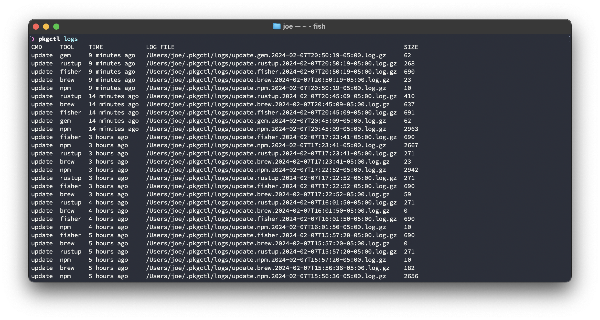

# pkgctl

A package manager for package managers.

## What is pkgctl?

`pkgctl` is a package manager that itself doesn't actually manage any individual packages. It is designed to be a single executable that can be used to, primarily, update the packages managed by other package managers.

No need to remember the exact command to update a package manager's packages. Just run `pkgctl update` and it will update all the package managers that it is aware of.

## Supported Package Managers

- [ASDF](https://asdf-vm.com/)
- [Fisher](https://github.com/jorgebucaran/fisher)
- [RubyGem](https://rubygems.org/)
- [Homebrew](https://brew.sh/)
- [npm](https://www.npmjs.com/)
- [pip](https://pypi.org/project/pip/)
- [RustUp](https://rustup.rs/)

## Installation

```shell
brew tap pkgctl/homebrew
brew install pkgctl
```

## Features

### Global Package Update

Update all packages managed by `pkgctl`'s supported package managers.

```shell
pkgctl update
```



### Logging

`pkgctl` stores logs of all of its actions. This can be useful for debugging or just to see what `pkgctl` has been up to.

```shell
pkgctl logs
```


